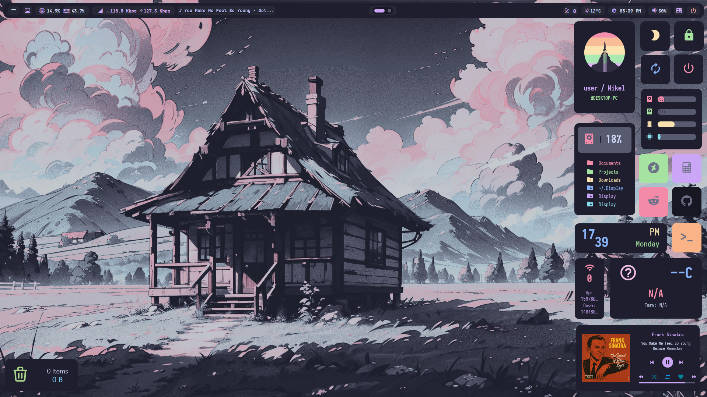
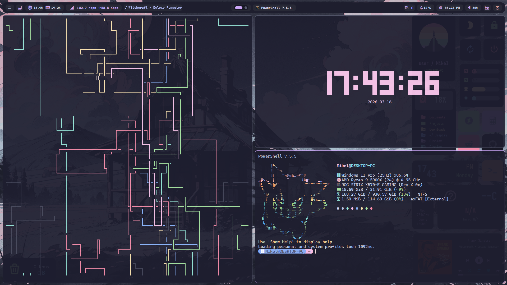

<div align="center">
  
  <h1>dotfiles — <a href="https://catppuccin.com">catppuccin</a> edition</h1>
  <p>Personal dotfiles for <strong>Windows</strong> (<a href="https://atlasos.net/">AtlasOS</a>) and <strong>Linux</strong> (<a href="https://cachyos.org/">CachyOS</a> / <a href="https://hypr.land/">Hyprland</a>), managed with <a href="https://www.chezmoi.io/">chezmoi</a>.</p>
  <p>
    <a href="https://github.com/Villoh/dotfiles/commits/main"></a>&nbsp;&nbsp;
    <a href="https://github.com/Villoh/dotfiles"></a>&nbsp;&nbsp;
    <a href="https://github.com/Villoh/dotfiles/blob/main/LICENSE"></a>&nbsp;&nbsp;
    <a href="https://github.com/Villoh/dotfiles/stargazers"></a>&nbsp;&nbsp;
  </p>
  <a href="#preview"><kbd>&nbsp;<br>&nbsp;Preview&nbsp;<br>&nbsp;</kbd></a>&ensp;&ensp;
  <a href="INSTALL.md"><kbd>&nbsp;<br>&nbsp;Install&nbsp;<br>&nbsp;</kbd></a>&ensp;&ensp;
  <a href="#extra-optional-setup-windows"><kbd>&nbsp;<br>&nbsp;Extras&nbsp;<br>&nbsp;</kbd></a>&ensp;&ensp;
  <a href="#overview"><kbd>&nbsp;<br>&nbsp;Features&nbsp;<br>&nbsp;</kbd></a>&ensp;&ensp;
  <a href="#credits"><kbd>&nbsp;<br>&nbsp;Credits&nbsp;<br>&nbsp;</kbd></a>&ensp;&ensp;
</div>

---

> [!WARNING]
> This repo is under active development and may contain bugs or breaking changes at any time. Use at your own risk.

## Preview

### Windows




### Linux

> Coming soon

## Overview

- **Manager:** chezmoi with `mode = "symlink"` — every managed file is a symlink to the chezmoi source, so edits take effect immediately without re-adding
- **Secrets scanning:** gitleaks via pre-commit hook
- **Submodules:** sddm and plymouth themes (run `git submodule update --init --recursive` after cloning)

### Windows

| Category | Tool | Config |
|----------|------|--------|
| Window Manager | [GlazeWM](https://github.com/glzr-io/glazewm) | [⚙️](dot_glzr/) |
| Status Bar | [YASB](https://github.com/amnweb/yasb) | [⚙️](dot_config/yasb/) |
| Shell | PowerShell 7 | [⚙️](Documents/PowerShell/) |
| Prompt | [Starship](https://starship.rs/) · [Oh My Posh](https://ohmyposh.dev/) | [⚙️](dot_config/starship.toml) · [⚙️](dot_config/ohmyposh/) |
| Terminal | [WezTerm](https://wezfurlong.org/wezterm/) · [Alacritty](https://alacritty.org/) · [Windows Terminal](https://aka.ms/terminal) | [⚙️](dot_config/wezterm/) · [⚙️](AppData/Roaming/alacritty/) · [⚙️](AppData/Local/Packages/Microsoft.WindowsTerminal_8wekyb3d8bbwe/LocalState/) |
| Editor | [Zed](https://zed.dev/) | [⚙️](dot_config/zed/) |
| File Manager | [yazi](https://yazi-rs.github.io/) | [⚙️](dot_config/yazi/) |
| App Launcher | [Flow Launcher](https://www.flowlauncher.com/) | [⚙️](AppData/Roaming/FlowLauncher/) |
| Clipboard | [Ditto](https://ditto-cp.sourceforge.io/) | [⚙️](program_files/ditto/) |
| Context Menu | [Nilesoft Shell](https://nilesoft.org/) | [⚙️](program_files/nilesoft/) |
| Hotkeys | [AutoHotkey](https://www.autohotkey.com/) | [⚙️](Documents/AutoHotkey/) |
| Desktop Widgets | [Rainmeter](https://www.rainmeter.net/) | [⚙️](Documents/Rainmeter/) |
| Customization | [Windhawk](https://windhawk.net/) | [⚙️](packages/windows/) |
| Resource Monitor | [btop](https://github.com/aristocratos/btop) | [⚙️](dot_config/btop/) |

### Linux

> My Linux setup is built on top of [HyDE](https://github.com/HyDE-Project/HyDE). If you're interested in a full Hyprland desktop setup, check it out first.

| Category | Tool | Config |
|----------|------|--------|
| Desktop | [HyDE](https://github.com/HyDE-Project/HyDE) + [Hyprland](https://hyprland.org/) | [⚙️](dot_config/hypr/) |
| Status Bar | [Waybar](https://github.com/Alexays/Waybar) | [⚙️](dot_config/waybar/) |
| Notifications | [SwayNC](https://github.com/ErikReider/SwayNotificationCenter) | [⚙️](dot_config/swaync/) |
| OSD Overlays | [SwayOSD](https://github.com/ErikReider/SwayOSD) | [⚙️](dot_config/swayosd/) |
| Shell | zsh | [⚙️](dot_config/zsh/) |
| Prompt | [Starship](https://starship.rs/) | [⚙️](dot_config/fastfetch/) |
| Terminal | [Kitty](https://sw.kovidgoyal.net/kitty/) · [Ghostty](https://ghostty.org/) | [⚙️](dot_config/kitty/) · [⚙️](dot_config/ghostty/) |
| Multiplexer | [tmux](https://github.com/tmux/tmux) · [psmux](https://github.com/psmux/psmux) | [⚙️](dot_config/tmux/) · [⚙️](dot_tmux.conf) |
| Editor | [Zed](https://zed.dev/) | [⚙️](dot_config/zed/) |
| File Manager | [yazi](https://yazi-rs.github.io/) | [⚙️](dot_config/yazi/) |
| Clipboard | [cliphist](https://github.com/sentriz/cliphist) | [⚙️](dot_config/cliphist/) |
| Discord | [Vesktop](https://github.com/Vencord/Vesktop) | [⚙️](dot_config/vesktop/) |
| Email | [aerc](https://aerc-mail.org/) | [⚙️](dot_config/aerc/) |
| Chat | [nchat](https://github.com/d99kris/nchat) | [⚙️](dot_config/nchat/) |
| YouTube | [FreeTube](https://freetubeapp.io/) | [⚙️](dot_config/FreeTube/) |
| Resource Monitor | [btop](https://github.com/aristocratos/btop) | [⚙️](dot_config/btop/) |

## Fresh install

See the full installation guide: **[INSTALL.md](INSTALL.md)**


## Wallpapers

- [orangci/walls-catppuccin-mocha](https://github.com/orangci/walls-catppuccin-mocha)
- [zhichaoh/catppuccin-wallpapers](https://github.com/zhichaoh/catppuccin-wallpapers)

## Credits

Windows setup inspired by and borrowed from:

- [jacquindev/windots](https://github.com/jacquindev/windots)
- [ashish0kumar/windots](https://github.com/ashish0kumar/windots)
- [ChrisTitusTech/powershell-profile](https://github.com/ChrisTitusTech/powershell-profile)
- [SleepyCatHey/Ultimate-Win11-Setup](https://github.com/SleepyCatHey/Ultimate-Win11-Setup)

Themes and cursors:

- [Catppuccin Cursors](https://www.deviantart.com/niivu/art/Catppuccin-Cursors-921387705) by niivu
- [Catppuccin for Windows 11](https://www.deviantart.com/niivu/art/Catppuccin-for-Windows-11-1076249390) by niivu

YASB themes:

- Comfyppuccin Reimagined by [AlmiWasFound](https://github.com/AlmiWasFound)

## PowerShell functions

Custom functions loaded from [`Documents/PowerShell/Functions/`](Documents/PowerShell/Functions/) on every shell session:

| Command | Description |
|---------|-------------|
| `restore-windhawk` | Import Windhawk settings from registry — close Windhawk first |
| `setup-wsl` | Install a WSL distro (fzf picker), configure locale and packages (Arch-specific) |
| `setup-gpg-ssh` | Configure GPG as SSH agent (startup shortcut + start agent) |
| `enable-devmode` | Enable Windows Developer Mode (required for chezmoi symlinks) |
| `disable-devmode` | Disable Windows Developer Mode |
| `upgrade` | Update all package managers and tools |
| `backup` | Backup dotfiles and settings |
| `restore` | Restore dotfiles and settings |
| `reset-run-once-scripts` | Clear `scriptState` so all `run_once_` scripts re-run on next apply |
| `reset-run-onchange-script [name]` | Clear `entryState` for one or all `run_onchange_` scripts |
| `startup-entries` | List all startup.json entries and their current enabled/disabled state |
| `disable-startup [name]` | Disable a startup entry (fzf picker if no name given) |
| `enable-startup [name]` | Enable a startup entry (fzf picker if no name given) |

## Daily workflow

```bash
# Edit a config directly — already in source via symlink
vim ~/.config/yazi/yazi.toml

# Sync everything to GitHub
dotfiles-sync

# Add a new file
chezmoi add ~/.config/newapp/config.toml

# Pull and apply from another machine
chezmoi update

# Check status
chezmoi status

# Run a run_once script manually (renders the template and executes it)
# Windows (PowerShell):
Get-Content "$(chezmoi source-path)\.chezmoiscripts\run_once_00_install-packages.ps1.tmpl" | chezmoi execute-template | powershell -NoProfile -Command -
# Linux (bash):
chezmoi execute-template "$(chezmoi source-path)/.chezmoiscripts/run_once_install-packages.sh.tmpl" | bash

# chezmoi script state buckets:
#   scriptState → run_once_     (keyed by content hash, cannot target individually)
#   entryState  → run_onchange_ (keyed by destination path)

# Re-run all run_once_ scripts on next apply
reset-run-once-scripts && chezmoi apply

# Re-run a specific run_onchange_ script on next apply
reset-run-onchange-script windows-setup && chezmoi apply

# Re-run all run_onchange_ scripts on next apply
reset-run-onchange-script && chezmoi apply

# See all tracked script states
chezmoi state dump --format=json | ConvertFrom-Json |
    Select-Object -ExpandProperty entryState | Get-Member -MemberType NoteProperty |
    Where-Object { $_.Name -like "*chezmoiscripts*" } | Select-Object -ExpandProperty Name
```
