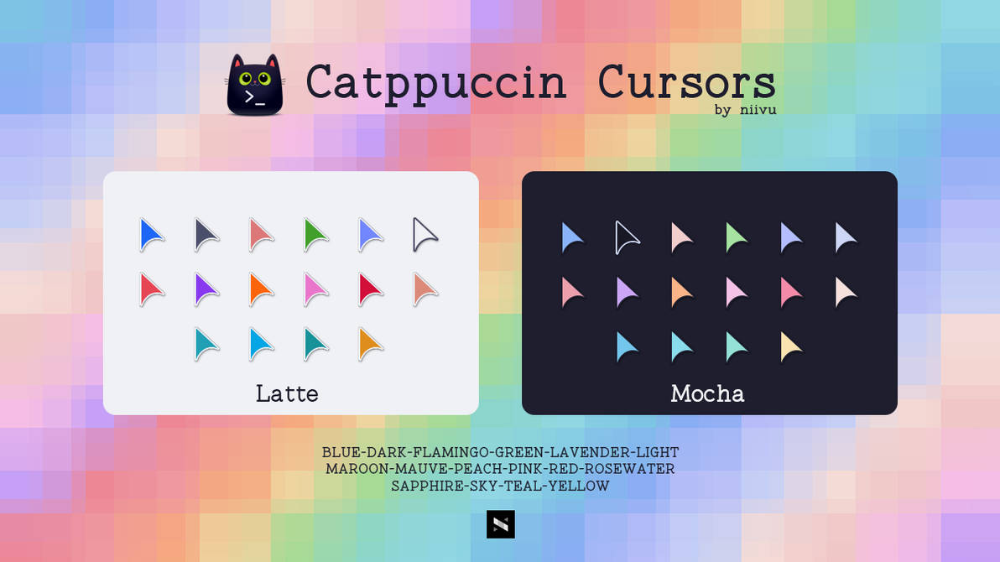
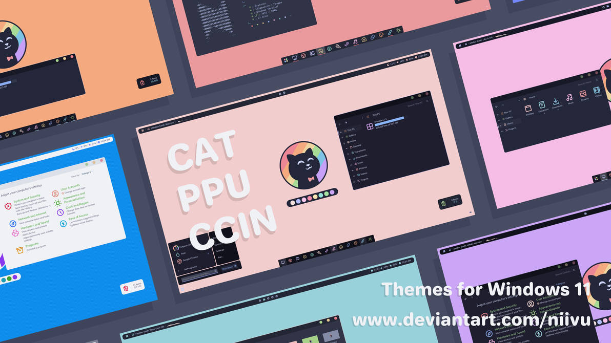

# dotfiles

Personal dotfiles for **Windows** ([AtlasOS](https://atlasos.net/)) and **Linux** ([CachyOS](https://cachyos.org/) / Hyprland), managed with [chezmoi](https://www.chezmoi.io/).

### Windows


## Overview

- **Manager:** chezmoi with `mode = "symlink"` — every managed file is a symlink to the chezmoi source, so edits take effect immediately without re-adding
- **Encryption:** GPG (`~/.config/git/local`, `gnupg/sshcontrol`)
- **Secrets scanning:** gitleaks via pre-commit hook
- **Submodules:** sddm and plymouth themes (run `git submodule update --init --recursive` after cloning)

## Fresh install

### Windows

#### Prerequisites

1. **Developer Mode** — required for symlinks without elevation:
   `Settings → System → For developers → Developer Mode`

2. **GPG** — install [GnuPG for Windows](https://www.gnupg.org/download/) and import your key:
   ```powershell
   gpg --import your-key.asc
   ```

3. **chezmoi** — install via winget:
   ```powershell
   winget install twpayne.chezmoi
   ```

#### Apply

```powershell
chezmoi init --apply github.com/Villoh/dotfiles
```

> **Without GPG key**, skip encrypted files:
> ```powershell
> chezmoi init github.com/Villoh/dotfiles
> chezmoi apply --exclude=encrypted
> ```

This will:
1. Clone the repo to `~/.local/share/chezmoi`
2. Generate `~/.config/chezmoi/chezmoi.toml` from the template
3. Create symlinks for all managed files
4. Run `run_once_` scripts: install packages, restore Windhawk, create Windows junctions

### Linux

#### Prerequisites

1. **GPG** — import your key:
   ```bash
   gpg --import your-key.asc
   ```

2. **chezmoi** — install via pacman or the install script:
   ```bash
   sudo pacman -S chezmoi
   ```

#### Apply

```bash
chezmoi init --apply github.com/Villoh/dotfiles
```

> **Without GPG key:**
> ```bash
> chezmoi init github.com/Villoh/dotfiles
> chezmoi apply --exclude=encrypted
> ```

#### Post-install

Install submodules (sddm/plymouth themes):
```bash
cd ~/.local/share/chezmoi
git submodule update --init --recursive
```

Set up gitleaks pre-commit hook:
```bash
uv tool install pre-commit
pre-commit install
```

## Windows junctions

The setup script creates these directory junctions/symlinks, pointing directly to the chezmoi source:

| Junction | → Chezmoi source |
|----------|-----------------|
| `%APPDATA%\Zed` | `dot_config/zed` |
| `%APPDATA%\yazi\config` | `dot_config/yazi` |
| `%APPDATA%\Vencord\settings` | `dot_config/vesktop/settings` |
| `~/scoop/persist/btop/btop.conf` | `dot_config/btop/btop.conf` |

## Package managers

### Windows (`packages/windows/`)

| Manager    | File                         | Notes                            |
|------------|------------------------------|----------------------------------|
| winget     | `winget-packages.json`       | GUI apps, system tools           |
| scoop      | `scoop-packages.json`        | CLI tools, fonts, dev tools      |
| chocolatey | `chocolatey-packages.config` | Packages not available elsewhere |
| npm        | `npm-packages.json`          | Global npm packages              |
| bun        | `bun-packages.txt`           | Global bun packages              |
| uv         | `uv-tools.txt`               | Python tools                     |

### Linux (`packages/linux/`)

Backups generated by `backup-packages` script:

| File | Contents |
|------|----------|
| `pacman.txt` | Explicitly installed pacman packages |
| `aur.txt` | AUR packages |
| `flatpak.txt` | Flatpak apps |
| `uv-tools.txt` | uv tools |
| `bun-global.txt` | Global bun packages |
| `npm-global.txt` | Global npm packages |

## Extra Optional Setup (Windows)

<details>
<summary>Catppuccin themes by Niivu</summary>

| Theme | Preview |
|-------|---------|
| [Catppuccin Cursors](https://www.deviantart.com/niivu/art/Catppuccin-Cursors-921387705) |  |
| [Catppuccin for Windows 11](https://www.deviantart.com/niivu/art/Catppuccin-for-Windows-11-1076249390) — [Install guide](https://www.deviantart.com/niivu/art/How-to-install-Windows-10-or-11-Themes-708835586) |  |

</details>

## Wallpapers

- [orangci/walls-catppuccin-mocha](https://github.com/orangci/walls-catppuccin-mocha)
- [zhichaoh/catppuccin-wallpapers](https://github.com/zhichaoh/catppuccin-wallpapers)

## Credits

Windows setup inspired by and borrowed from:

- [jacquindev/windots](https://github.com/jacquindev/windots)
- [ashish0kumar/windots](https://github.com/ashish0kumar/windots)
- [ChrisTitusTech/powershell-profile](https://github.com/ChrisTitusTech/powershell-profile)
- [SleepyCatHey/Ultimate-Win11-Setup](https://github.com/SleepyCatHey/Ultimate-Win11-Setup)

## Daily workflow

```bash
# Edit a config directly — already in source via symlink
vim ~/.config/yazi/yazi.toml

# Sync everything to GitHub
dotfiles-sync

# Add a new file
chezmoi add ~/.config/newapp/config.toml

# Pull and apply from another machine
chezmoi update

# Check status
chezmoi status
```
