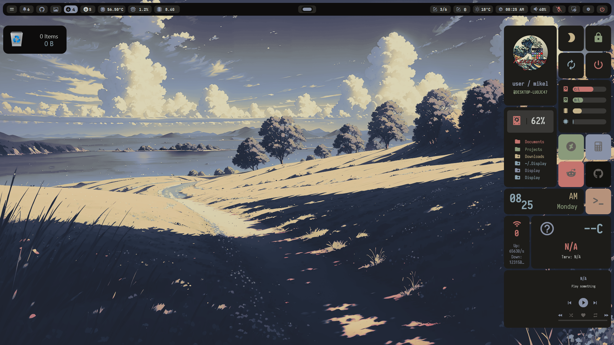
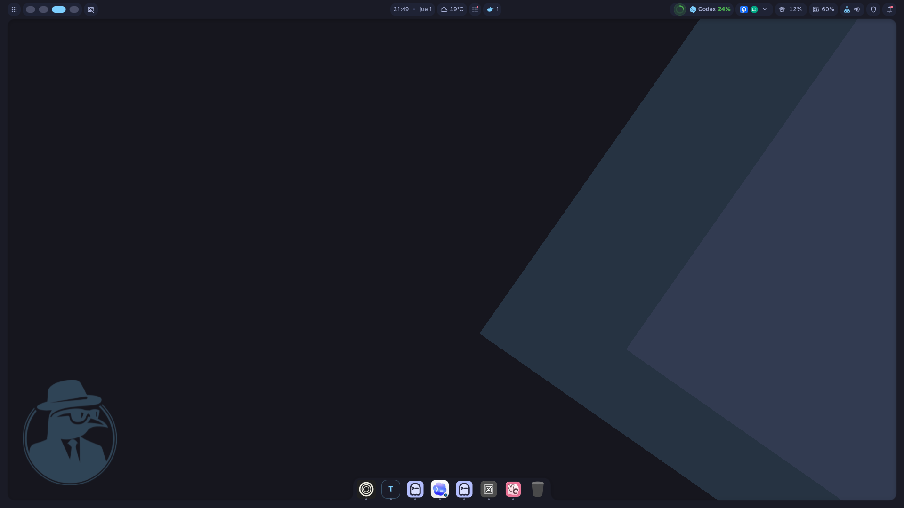

<div align="center">
  <a href="https://github.com/Gurjaka/Kanagawa-Wallpapers/blob/main/kanagawa.svg"></a>
  <h1>dotfiles — Kanagawa Dragon</a> edition</h1>
  <p>Personal Kanagawa Dragon dotfiles for <strong>Windows</strong> (<a href="https://atlasos.net/">AtlasOS</a>) and <strong>Linux</strong> (<a href="https://nixos.org/">NixOS</a> + <a href="https://danklinux.com/">Dank Material Shell</a> + <a href="https://hypr.land/">Hyprland</a>), managed with <a href="https://www.chezmoi.io/">chezmoi</a>.</p>
  <p>
    <a href="https://github.com/Villoh/dotfiles/commits/main"></a>&nbsp;&nbsp;
    <a href="https://github.com/Villoh/dotfiles"></a>&nbsp;&nbsp;
    <a href="https://github.com/Villoh/dotfiles/blob/main/LICENSE"></a>&nbsp;&nbsp;
    <a href="https://github.com/Villoh/dotfiles/stargazers"></a>&nbsp;&nbsp;
  </p>
  <a href="#preview"><kbd>&nbsp;<br>&nbsp;Preview&nbsp;<br>&nbsp;</kbd></a>&ensp;&ensp;
  <a href="INSTALL.md"><kbd>&nbsp;<br>&nbsp;Install&nbsp;<br>&nbsp;</kbd></a>&ensp;&ensp;
  <a href="#extra-optional-setup-windows"><kbd>&nbsp;<br>&nbsp;Extras&nbsp;<br>&nbsp;</kbd></a>&ensp;&ensp;
  <a href="#overview"><kbd>&nbsp;<br>&nbsp;Features&nbsp;<br>&nbsp;</kbd></a>&ensp;&ensp;
  <a href="#credits"><kbd>&nbsp;<br>&nbsp;Credits&nbsp;<br>&nbsp;</kbd></a>&ensp;&ensp;
</div>

---

> [!WARNING]
> This repo is under active development and may contain bugs or breaking changes at any time. Use at your own risk.

## Preview

### Windows



### Linux



## Overview

- **Theme:** Kanagawa Dragon across active Windows and Linux surfaces; Kanagawa Wave is used where Windows requires a native theme fallback
- **Manager:** chezmoi with `mode = "symlink"` — every managed file is a symlink to the chezmoi source, so edits take effect immediately without re-adding
- **Secrets scanning:** gitleaks via pre-commit hook
- **Submodules:** sddm and plymouth themes (run `git submodule update --init --recursive` after cloning)

### Windows

| Category | Tool | Config |
| ---------- | ------ | -------- |
| Window Manager | [GlazeWM](https://github.com/glzr-io/glazewm) | [⚙️](dot_glzr/) |
| Status Bar | [YASB](https://github.com/amnweb/yasb) | [⚙️](dot_config/yasb/) |
| Shell | PowerShell 7 | [⚙️](Documents/PowerShell/) |
| Prompt | [Starship](https://starship.rs/) · [Oh My Posh](https://ohmyposh.dev/) | [⚙️](dot_config/starship.toml) · [⚙️](dot_config/ohmyposh/) |
| Terminal | [WezTerm](https://wezfurlong.org/wezterm/) · [Alacritty](https://alacritty.org/) · [Windows Terminal](https://aka.ms/terminal) | [⚙️](dot_config/wezterm/) · [⚙️](AppData/Roaming/alacritty/) · [⚙️](AppData/Local/Packages/Microsoft.WindowsTerminal_8wekyb3d8bbwe/LocalState/) |
| Editor | [Zed](https://zed.dev/) | [⚙️](dot_config/zed/) |
| File Manager | [yazi](https://yazi-rs.github.io/) | [⚙️](dot_config/yazi/) |
| App Launcher | [Flow Launcher](https://www.flowlauncher.com/) | [⚙️](AppData/Roaming/FlowLauncher/) |
| Clipboard | [Ditto](https://ditto-cp.sourceforge.io/) | [⚙️](program_files/ditto/) |
| Context Menu | [Nilesoft Shell](https://nilesoft.org/) | [⚙️](program_files/nilesoft/) |
| Hotkeys | [AutoHotkey](https://www.autohotkey.com/) | [⚙️](Documents/AutoHotkey/) |
| Desktop Widgets | [Rainmeter](https://www.rainmeter.net/) | [⚙️](Documents/Rainmeter/) |
| Customization | [Windhawk](https://windhawk.net/) | [⚙️](packages/windows/) |
| Resource Monitor | [btop](https://github.com/aristocratos/btop) | [⚙️](dot_config/btop/) |

### Linux

> The Linux installation is **NixOS + Hyprland + Dank Material Shell (DMS)**.
> NixOS/Home Manager owns the system, packages, services, hardware, Hyprland,
> and DMS. Chezmoi only manages personal dotfiles and scripts that are not
> declared in my [NixOS configuration](https://github.com/Villoh/nixos-config).
> Do not run Arch/CachyOS package installers or use pacman/AUR lists from this
> repository.

| Category | Tool | Config |
| ---------- | ------ | -------- |
| Desktop | [NixOS](https://nixos.org/) + [Hyprland](https://hyprland.org/) + [DMS](https://danklinux.com/) | [Villoh/nixos-config](https://github.com/Villoh/nixos-config) |
| Shell UI (bar, dock, notifications, OSD, launcher, clipboard) | [Dank Material Shell](https://danklinux.com/) | [⚙️](dot_config/DankMaterialShell/) |
| Dynamic Theming | [Matugen](https://github.com/InioX/matugen) | [⚙️](dot_config/matugen/) |
| Shell | [Zsh](https://www.zsh.org/) + [Oh My Zsh](https://ohmyz.sh/) | [⚙️](dot_zshrc) · [Home Manager](https://github.com/Villoh/nixos-config/blob/main/modules/home/shell/zsh.nix) |
| Prompt | [Starship](https://starship.rs/) | [Home Manager](https://github.com/Villoh/nixos-config/blob/main/modules/home/shell/zsh.nix) |
| Terminal | [Ghostty](https://ghostty.org/) · [Kitty](https://sw.kovidgoyal.net/kitty/) | [Home Manager](https://github.com/Villoh/nixos-config/blob/main/modules/home/terminals/ghostty.nix) · [Home Manager](https://github.com/Villoh/nixos-config/blob/main/modules/home/terminals/kitty.nix) |
| Multiplexer | Herdr | [⚙️](dot_config/herdr/) |
| Editor | [Zed](https://zed.dev/) · [Neovim](https://neovim.io/) | [⚙️](dot_config/zed/) · [Home Manager](https://github.com/Villoh/nixos-config/blob/main/modules/home/development/neovim.nix) |
| File Manager | [yazi](https://yazi-rs.github.io/) | [⚙️](dot_config/yazi/) |
| Discord | [Vesktop](https://github.com/Vencord/Vesktop) · Concord | [⚙️](dot_config/vesktop/) · [⚙️](dot_config/private_concord/) |
| Chat | [nchat](https://github.com/d99kris/nchat) | [⚙️](dot_config/nchat/) |
| Music | [ytm-player](https://github.com/peternaame-boop/ytm-player) · [cava](https://github.com/karlstav/cava) | [⚙️](dot_config/ytm-player/) · [⚙️](dot_config/cava/) |
| AI Agents | [Claude Code](https://claude.com/claude-code) · [Codex](https://github.com/openai/codex) · Pi · omp · Devin · [opencode](https://opencode.ai/) | [⚙️](dot_claude/) · [⚙️](dot_codex/) · [⚙️](dot_pi/) · [⚙️](dot_omp/) · [⚙️](dot_config/devin/) · [⚙️](dot_config/opencode/) |

## NixOS and chezmoi

NixOS is the declarative source of truth for the Linux system. Use chezmoi for
personal configuration that has no suitable Nix/Home Manager module. Review
`chezmoi diff` before applying anything; initialization does not apply files.

## Fresh install

See the full installation guide: **[INSTALL.md](INSTALL.md)**. OS-specific
installation guides live in [`docs/install/`](docs/install/), followed by the
common GPG/SSH/Git/chezmoi bootstrap.

## Wallpapers

- [Gurjaka/Kanagawa-Wallpapers](https://github.com/Gurjaka/Kanagawa-Wallpapers)
- Active desktop wallpaper: `Pictures/Wallpapers/main-wallpaper.png`

## Credits

Windows setup inspired by and borrowed from:

- [jacquindev/windots](https://github.com/jacquindev/windots)
- [ashish0kumar/windots](https://github.com/ashish0kumar/windots)
- [ChrisTitusTech/powershell-profile](https://github.com/ChrisTitusTech/powershell-profile)
- [SleepyCatHey/Ultimate-Win11-Setup](https://github.com/SleepyCatHey/Ultimate-Win11-Setup)

## PowerShell functions

Custom functions loaded from [`Documents/PowerShell/Functions/`](Documents/PowerShell/Functions/) on every shell session. Windows only. On Linux the Git helpers are standalone `git-*` scripts in `dot_local/bin/git/`.

### Dotfiles and chezmoi

| Command | Description |
| --------- | ------------- |
| `dotfiles-sync` / `dsync` | `git add .`, commit with a timestamp and push, through `chezmoi git` |
| `dapply` | `chezmoi apply` |
| `dedit [path]` | `chezmoi edit` |
| `dupdate` | `chezmoi git -- pull` and `chezmoi apply` |
| `reset-run-once-scripts` | Clear `scriptState` so all `run_once_` scripts re-run on next apply |
| `reset-run-onchange-script [name]` | Clear `entryState` for one or all `run_onchange_` scripts |
| `secrets` | Re-run the Windows secrets script from `packages/windows/system/secrets.json` |
| `agent-skills [tui\|list]` | Enable or disable shared agent skills in `~/.agents/skills` (TUI), or list them with `--enabled` / `--disabled` |

### Packages

Managers: `winget`, `scoop`, `npm`, `bun`, `pnpm`, `uv`, `bin`, `cargo`, `mise`, `herdr`. `-Manager` limits the run to some of them.

| Command | Description |
| --------- | ------------- |
| `backup` / `backup-pkgs` | Export package lists to `packages/windows/` |
| `backup-<manager>` | Back up a single manager; also `backup-windhawk` |
| `restore` / `restore-pkgs` | Reinstall from the saved lists (fzf picker, or `-Manager`) |
| `restore-<manager>` | Restore a single manager; also `restore-winget-elevated` and `restore-windhawk` |
| `update` / `update-all` / `upgrade-all` | Upgrade every manager (`-Manager` to pick some) |
| `update-<manager>` / `upgrade-<manager>` | Upgrade one manager (`winget`, `scoop`, `npm`, `bun`, `pnpm`, `uv`, `mise`, `node`) |
| `winget-reinstall <id>` | Uninstall and reinstall a winget package in an elevated window |
| `migrate [-Source] [-Target]` | Move packages between managers: `winget` <-> `scoop`, or any direction between `npm`, `bun` and `pnpm` |
| `pnpm-add-fresh <pkg>` | `pnpm add -g` ignoring the minimum release age |
| `prune [target]` | Clean package manager caches (scoop, npm, pnpm, bun, uv, ...) |
| `clear-pip` | Clear the pip environment (asks for confirmation) |
| `restore-windhawk` | Import Windhawk settings from the registry file; close Windhawk first |

### AI agents

| Command | Description |
| --------- | ------------- |
| `update-harness` / `upgrade-harness` | Update the whole agent harness: skills, Context7, Caveman, headroom, Serena and impeccable |
| `update-skills`, `update-context7`, `update-caveman`, `update-headroom`, `update-serena`, `update-impeccable` | Update a single piece (every one also has an `upgrade-` alias) |
| `install-claude-plugins` | Install the Claude Code plugins listed in `enabledPlugins` that are missing |
| `claudex` | Run Claude Code against `gpt-5.6-sol` with its subagent and tool settings |

### Git

| Command | Description |
| --------- | ------------- |
| `remote-default` | Name of the remote default branch |
| `remote-set <name> <url>` | Add the remote, or update its URL if it exists |
| `old` | List local branches with age, ahead/behind and merged state |
| `conflict <branch>` / `cf` | Show the conflicts a merge would cause |
| `can-merge <branch>` / `cfm` | Check whether a merge would be clean |
| `continue-git` / `abort-git` | Continue or abort the rebase, merge, cherry-pick or revert in progress |
| `prune-local` | Delete local branches whose remote is gone |
| `clean-merged` | Delete branches already merged (except main, master, develop) |
| `auto-prune` | Update the default branch and delete branches with nothing left to merge |
| `fixup <commit>` | Create a fixup commit and autosquash it (aborts if it would conflict) |
| `rebranch` | Rebuild the current branch on top of the updated default branch |
| `yank` | Reset to the remote branch, keeping a backup branch if you had local commits |
| `backmerge <branch>` | Pull the branch and merge it into the current one |
| `churn` | The 25 most modified files in the history |
| `glines <branch> [-Exclude ...]` | Lines changed against a branch |
| `sha [ref]` | Short SHA, copied to the clipboard |
| `gitzip` | Zip `HEAD` named after its tag |
| `diff-file-last-commit <file>` | Diff a file against its previous commit |
| `gexclude <path>` / `ginclude <path>` | Add or remove a path in `.git/info/exclude` |
| `gtree` | Tree of tracked and untracked files |
| `server-start [remote]` | Serve the current repository over the LAN with `git daemon` |
| `server-kill`, `server-test`, `server-clone`, `server-join`, `server-logs` | Stop it, test it, clone from it, point `origin` to it, follow its log |

### Terminal tools

| Command | Description |
| --------- | ------------- |
| `y` | Launch yazi and `cd` to the last directory on exit (`q`; `Q` quits without changing it) |
| `zj [query]` | Attach to or create a zellij session named after the directory (resolved with zoxide if `query` is given) |
| `zwork [query]` | Attach to or create the persistent `villoh` zellij session |
| `keybinds` | Show Alacritty, Zellij and GlazeWM keybindings in `less` |
| `keybinds-al` / `keybinds-zj` / `keybinds-gwm` | Show only the Alacritty, Zellij or GlazeWM ones |
| `npm` | Wrapper: runs `socket npm` |

### Windows setup

| Command | Description |
| --------- | ------------- |
| `setup-wsl` | Install a WSL distro (fzf picker), configure locale and packages (Arch-specific) |
| `setup-gpg-ssh` | Configure GPG as SSH agent (startup shortcut + start agent) |
| `enable-devmode` / `disable-devmode` | Toggle Windows Developer Mode (required for chezmoi symlinks) |
| `disable-win-keys` / `enable-win-keys` | Disable or restore Windows key shortcuts so GlazeWM can use `Win` (`-Scope User\|System`) |
| `win-keys-status` | Show whether the Windows key shortcuts are disabled (user, system and effective) |
| `startup-entries` | List all startup.json entries and their current enabled/disabled state |
| `disable-startup [name]` / `enable-startup [name]` | Disable or enable a startup entry (fzf picker if no name given) |

### Bitwarden

Needs the `bw` CLI; `fzf` is optional.

| Command | Description |
| --------- | ------------- |
| `bwstart` | Log in if needed, unlock and sync in one step |
| `bwlogin`, `bwlock`, `bwsync`, `bwconfig` | Log in (`-Sso`, `-ApiKey`), lock and clear the session, sync, and manage the server |
| `bwu` | Vault state: `unauthenticated`, `locked` or `unlocked` |
| `bwls`, `bwfind`, `bwitem` | List (fzf, bulk trash or delete), search and show items |
| `bwadd`, `bwedit`, `bwmv`, `bwattachment` | Create (login, card, identity, SSH key), edit, move and download attachments |
| `bwfolder`, `bwcollection`, `bwtemplate` | Folders, organization collections and item templates |
| `bwgen` | Generate a password interactively and copy it |
| `bwtrash`, `bwrestore`, `bwdelete`, `bwempty` | Trash, restore, delete permanently and empty the trash |

## Daily workflow

```bash
# Edit a config directly — already in source via symlink
vim ~/.config/yazi/yazi.toml

# Sync everything to GitHub
dotfiles-sync

# Add a new file
chezmoi add ~/.config/newapp/config.toml

# Pull and apply from another machine
chezmoi update

# Check status
chezmoi status

# Run a run_once script manually (renders the template and executes it)
# Windows (PowerShell):
Get-Content "$(chezmoi source-path)\.chezmoiscripts\run_once_00_install-packages.ps1.tmpl" | chezmoi execute-template | powershell -NoProfile -Command -
# Linux (bash):
chezmoi execute-template "$(chezmoi source-path)/.chezmoiscripts/run_once_install-packages.sh.tmpl" | bash

# chezmoi script state buckets:
#   scriptState → run_once_     (keyed by content hash, cannot target individually)
#   entryState  → run_onchange_ (keyed by destination path)

# Re-run all run_once_ scripts on next apply
reset-run-once-scripts && chezmoi apply

# Re-run a specific run_onchange_ script on next apply
reset-run-onchange-script windows-setup && chezmoi apply

# Re-run all run_onchange_ scripts on next apply
reset-run-onchange-script && chezmoi apply

# See all tracked script states
chezmoi state dump --format=json | ConvertFrom-Json |
    Select-Object -ExpandProperty entryState | Get-Member -MemberType NoteProperty |
    Where-Object { $_.Name -like "*chezmoiscripts*" } | Select-Object -ExpandProperty Name
```
